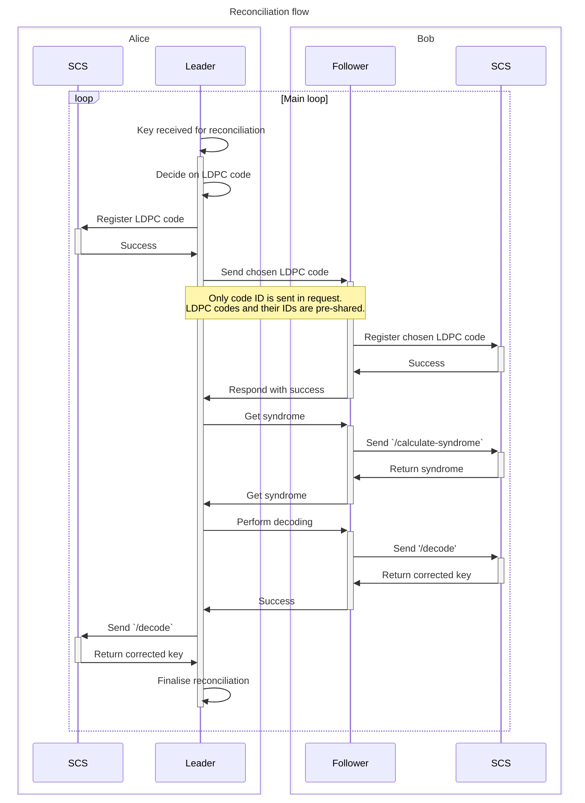
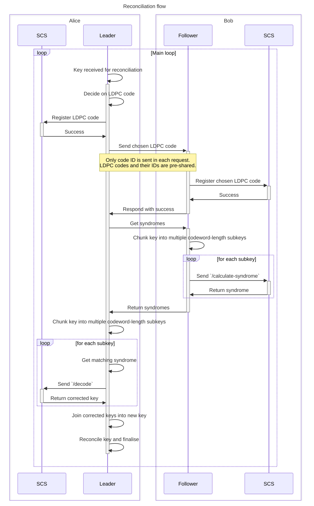

Planned concept:

```mermaid
sequenceDiagram
    title Reconciliation flow

    box Alice
    participant SCSL as SCS
    participant L as Leader
    end
    
    box Bob
    participant F as Follower
    participant SCSF as SCS
    end

    loop Main loop
    L ->>+ L : Key received for reconciliation

    L ->> L : Decide on LDPC code

    L ->>+ SCSL : Register LDPC code
    SCSL ->>- L : Success

    L ->>+ F : Send chosen LDPC code
    Note over L,F : Only code ID is sent in request. <br/> LDPC codes and their IDs are pre-shared.
    F ->>+ SCSF : Register chosen LDPC code
    SCSF ->>- F : Success
    F ->>- L : Respond with success

    L ->>+ F : Get syndrome
    F ->>+ SCSF : Send `/calculate-syndrome`
    SCSF ->>- F : Return syndrome
    F ->>- L : Get syndrome
    
    L ->>+ F: Perform decoding

    F ->>+ SCSF : Send '/decode'
    SCSF ->>- F : Return corrected key
    F ->>- L : Success

    L ->>+ SCSL : Send `/decode`
    SCSL ->>- L : Return corrected key

    L ->>- L : Finalise reconciliation

    end
```

Actual impl:

```mermaid
sequenceDiagram
    title Reconciliation flow

    box Alice
    participant SCSL as SCS
    participant L as Leader
    end
    
    box Bob
    participant F as Follower
    participant SCSF as SCS
    end

    loop Main loop
    L ->>+ L : Key received for reconciliation

    L ->> L : Decide on LDPC code

    L ->>+ SCSL : Register LDPC code
    SCSL ->>- L : Success

    L ->>+ F : Send chosen LDPC code
    Note over L,F : Only code ID is sent in each request. <br/> LDPC codes and their IDs are pre-shared.
    F ->>+ SCSF : Register chosen LDPC code
    SCSF ->>- F : Success
    F ->>- L : Respond with success

    L ->>+ F : Get syndromes
    F ->> F : Chunk key into multiple codeword-length subkeys
    loop for each subkey
    F ->>+ SCSF : Send `/calculate-syndrome`
    SCSF ->>- F : Return syndrome
    end
    F ->>- L : Return syndromes

    L ->> L : Chunk key into multiple codeword-length subkeys
    loop for each subkey
    L ->> L : Get matching syndrome
    L ->>+ SCSL : Send `/decode`
    SCSL ->>- L : Return corrected key
    end

    L ->> L : Join corrected keys into new key

    L ->>- L : Reconcile key and finalise

    end
```
